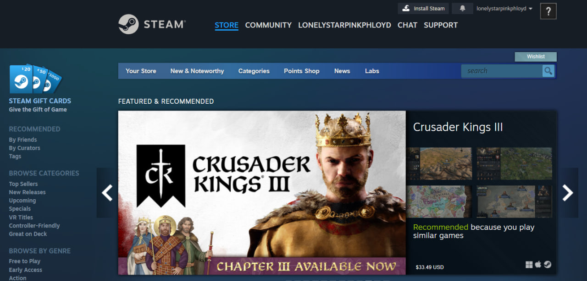
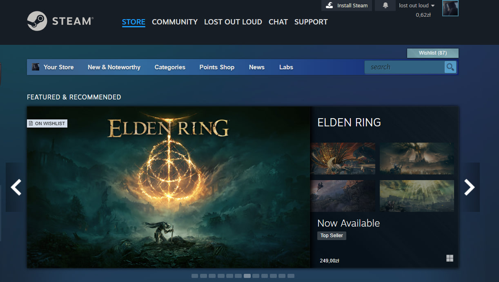
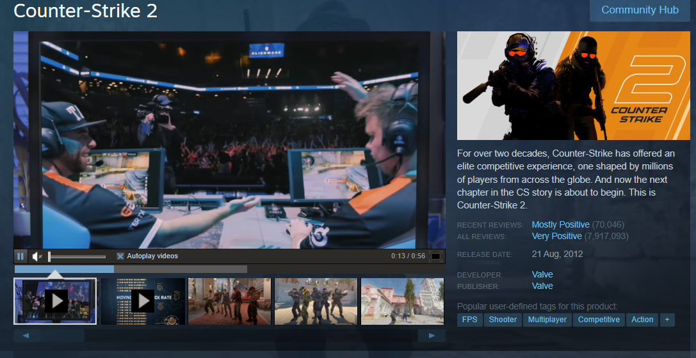
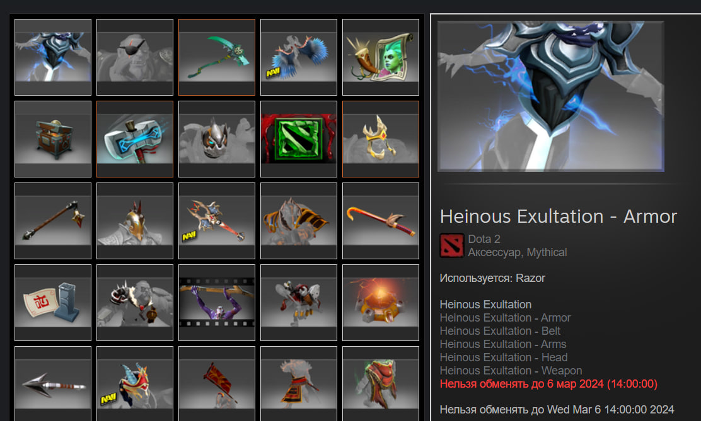

# https://store.steampowered.com # 

Тест кейс № |	1 
:--- | :---
Заголовок |	Регистрация 
Предусловие |	Открыта главная страница сайта 

**Этапы**:

1. В верхнем правом углу навигационной панели нажать на кнопку «login».
2. Пролистать страницу вниз.
3. Нажать на кнопку «Create an account».
4. Ввести валидный e-mail, содержащий символ «@» в поле «Email Address».
5. Ввести email в том же формате ещё раз в поле «Confirm your Address».
6. В выпадающем списке с названием «Country of Residence» выбрать страну
7. Подтвердить capture через чекбокс
8. Подтвердить возраст 13+ лет, соглашение с политикой приватности и пользовательское соглашение через чекбокс
9. Нажать кнопку «Continue.
10. Подтвердить регистрацию на электронной почте нажатием на гиперссылку «Verify my email address
11. Ввести имя аккаунта (кириллица/латиница) в поле Steam Account Name
12. Ввести пароль в поле «Choose Password», минимум 8 символов используя числа, буквы в нижнем и верхнем регистре, специальные символы
13. Подтвердить пароль в поле «Confirm Password»
14. Нажать кнопку «Done»

&nbsp; | &nbsp;
:--- | :---
**Результат** | Открылась главная страница. Пользователь успешно зарегистрирован и авторизован 

   

 

---

 

Тест кейс № | 2
:--- | :---
Заголовок |	Аутентификация
Предусловие |	Открыта главная страница сайта
**Этапы**:
1. В верхнем правом углу навигационной панели нажать на кнопку «login»	
2. <<Опционально>> при наличии мобильного приложения отсканировать QR-код
3. Ввести логин в поле «Sign in with account name»
4. Ввести пароль  в поле «Password»
5. Нажать на кнопку «Sign In»
6. Подтверждаем вход в аккаунт в мобильном приложении

&nbsp; | &nbsp;
:--- | :---
**Результат** | Пользователь успешно авторизован. Открылась главная страница магазина

   

 

---

 

Тест кейс № | 3
:--- | :---
Заголовок |	Поиск игры в каталоге
Предусловие |	Открыта главная страница сайта
**Этапы**:
1. В элементе поиска возле панели навигации вводим необходимое нам название игры - «CS2»
2. Нажимаем на всплывающий элемент с изображением и названием игры

&nbsp; | &nbsp;
:--- | :---
**Результат** | Поиск выполнен успешно. Открылась тематическая страница игры

    

 

---

 

Тест кейс № | 4
:--- | :---
Заголовок |	Попытка покупки игры
Предусловие |	Открыта страница с игрой в каталоге, пройдена авторизация, баланс кошелька < стоимось игры
**Этапы**:
1. Возле ценника игры нажимаем на кнопку «Add to cart»
2. Нажимаем на кнопку «Purchase for myself»
3. Можем выбрать из выпадающего списка метод пополнения необходимой суммы до покупки игры
4. Нажимаем кнопку Back

&nbsp; | &nbsp;
:--- | :---
**Результат** | Нас возвращает на метод покупки через кошелёк, на котором недостаточно средств, полностью отменить процесс покупки на данной странице невозможно.

 

---

 

Тест кейс № | 5
:--- | :---
Заголовок |	Покупка специфического предмета на торговой площадке
Предусловие |	Открыта главная страница веб-сайта, пройдена авторизация, стоимость предмета <= баланс пользователя
**Этапы**:
1. В верху страницы в навигационной панели нажимаем на текст «Community»
2. Во всплывающем списке выбираем «Market»
3. Скролим до фильтров и панели поиска
4. Выбираем нужную нам игру из панели быстрого доступа - «Dota 2»
5. В элементе поиска вводим название нужного нам предмета - «Heinous Exultation - Armor»
6. Выбираем нужный нам предмет
7. Скролим до списка активных лотов
8. Нажимаем Buy Now в ячейке с понравившимся нам лотом
9. Пролистываем детализацию
10. Активируем чекбокс с принятием пользовательского соглашения 
11. Подтверждаем покупку нажатием на кнопку «Purchase»
12. Нажимаем на кнопку «Close»

&nbsp; | &nbsp;
:--- | :---
**Результат** | Успешно совершена покупка внутриигрового предмета, данный предмет добавлен в инвентарь пользователя

    

 

---

 

Тест кейс № | 6
:--- | :---
Заголовок |	Изменение имени пользователя
Предусловие |	Открыта главная страница веб-сайта, пройдена авторизация
**Этапы**:
1. В верху страницы в навигационной панели наводим курсор на текущее имя пользователя
2. Во всплывающем списке выбираем вкладку «Profile»
3. В правой части экрана нажимаем на кнопку «Edit Profile»
4. В текстбоксе "PROFILE NAME" меняем имя пользователя
5. Скролим в самый низ страницы
6. Нажимаем кнопку «Save»

&nbsp; | &nbsp;
:--- | :---
**Результат** | Имя пользователя успешно изменено 

 

---

 